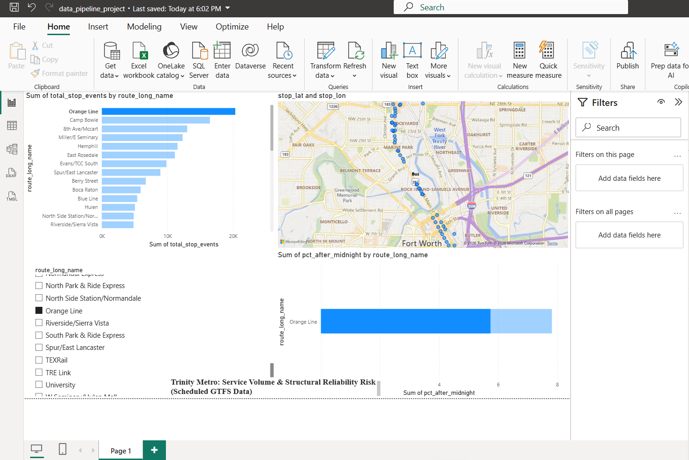

# Trinity Metro Data Pipeline

An end-to-end data engineering project...

## Business Question
Which Trinity Metro routes carry the most structural service risk, and where?

## Architecture
Raw GTFS files → PostgreSQL (raw) → dbt (staging + marts) → Power BI dashboard → AI automation

- **Extract**: Python scripts pull GTFS static data from Trinity Metro's public feed
- **Load**: 16 raw tables loaded into PostgreSQL (177,225 scheduled stop events)
- **Transform**: dbt models — 5 staging views, a star-schema fact table, and
  analytical marts. 8 data-quality tests on keys.
- **Visualize**: Interactive Power BI dashboard (route rankings + geographic stop map)
- **Automate**: Weekly AI briefing — queries the mart, pre-computes facts in code,
  and uses an LLM (Groq) to write plain-English commentary. Built in both Python
  and n8n.

## Key Engineering Decisions
- **ELT over ETL**: raw data loaded untouched, transformed in-warehouse
- **GTFS ghost times**: handled service times past 24:00:00 (post-midnight trips)
- **LLM fact-safety**: rankings pre-computed in code so the AI never fabricates numbers

## Honest Scope
This project uses **scheduled** GTFS data. It measures structural service patterns
(volume, frequency, late-night share), not actual vehicle arrival performance —
Trinity Metro does not publish a public real-time feed.

## Tech Stack
Python · PostgreSQL · dbt · Power BI · n8n · Groq API

## Findings
- The Orange Line leads the network with 20,331 scheduled stop events
- Late-night service is concentrated on just 3 of 38 routes
- Short-loop routes (Blue Line, TRE Link) show high-repetition service patterns
